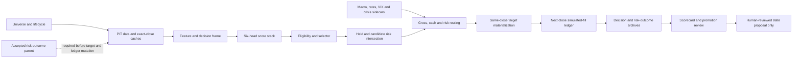

# R1000 end-to-end connection and bottleneck plan

Date: 2026-08-26

Repository: `wscha231/r1000-quant-engine`

Observed source base: P0-4 merge
`ee3560f7ee694e4ffd697e5765ea287c6d73ab59`

## Executive decision

The repository has a coherent research-to-paper architecture and one official
simulated-fill writer, but the operating loop is not currently advancing. The
first blocker is not stock ranking, macro detection, or an order-calculation
bug. It is the deliberate absence of an accepted risk-outcome parent. The
scheduled workflow correctly stops before prices, targets, or the paper ledger
can change.

P0-5 adds the missing durable preflight receipt and preserves this stop. The
next state-changing action is a separately approved one-time legacy quarantine,
not a scheduled fallback or blind rerun.

## Current connected flow

Macro, VIX, rates, and crisis inputs route exposure, cash, and risk. They are
not hidden stock-alpha labels. OHLCV location timing remains a non-gating
research sidecar. `daily_operating_selection_refresh.yml` is the sole official
US target and simulated-fill ledger writer. Legacy Alpaca utilities and
workflows with live-sounding names have no canonical authority.

## Connection-state map

| Boundary | Connection state | Principal evidence | Current limitation |
|---|---|---|---|
| Universe and security lifecycle | Connected, fail-closed | Shared lifecycle resolver across scorer, targets, preview, and ledger | Historical Russell membership and complete delisted identity remain not PIT-clean |
| Prices and technical data | Multiple collectors connected | Exact-session gates and replay price manifests exist | Official cross-workflow freshness is inconsistent; a green free-data job previously ended at 2026-07-02 while another lane reached 2026-08-21 |
| SEC Form 4 / 13F / ETF confirmation | Connected as PIT confirmation inputs | Exact accepted-time and immutable upstream contracts | Semantic coverage is source-specific; confirmation evidence cannot independently authorize selection |
| Earnings and estimates | Forward collector connected | Bounded queue and missing-neutral archive | Free coverage is sparse and cannot be backfilled into 2019-2026 history |
| Macro / rates / VIX / crisis | Connected advisory sidecars | Exact-date macro and crisis contracts | A green monitor alone does not prove the same inputs reached an accepted paper transaction |
| Decision frame and model heads | Reproducible on the last validated packet | 989 rows, 238 features, six active nonzero heads in the prior audit | The evidence is historical/current-advisory, not proof of a fresh accepted operating session |
| Selector and candidate gate | Connected in no-write mode | Official pinned selector plus held/candidate risk intersection | One-date turnover was 44.7-50.2% Main and 60.8% Concentrated; stability evidence is underpowered |
| Same-close targets | Contract exists and is fail-closed | Date/hash-bound target builder | No current target may be materialized while the parent/root and freshness gates are blocked |
| Buy/sell proposal | Review-only simulated path exists | Next-close, integer-share, 25 bps, idempotent preview/ledger contracts | No broker/live authority; order previews are not fills |
| Paper ledger | Valid separate immutable chain observed | Six heads through 2026-07-24, terminal `65fa6f5...` | It is chronologically stale and distinct from the missing risk-outcome head |
| Risk-outcome ledger | Blocked by design | Legacy summary `5a57e4...`, zero accepted heads | Requires one-time, explicit legacy-quarantine authorization |
| Scorecard and promotion | Connected after accepted transaction | Single promotion/rollback state machine | Canonical state remains `RESEARCH_ONLY`; forward outcome counts are underpowered |
| Cross-platform validation | Git blob identity is pinned | LF Git blob matches the registered OHLCV pattern-memory hash | Windows `core.autocrlf=true` rewrites that contract to CRLF, causing two known smoke-test failures |

## Bottlenecks in priority order

### P0 — accepted risk-outcome root

The workflow has no immutable accepted risk-outcome head and does have one
known legacy review-only summary. Scheduled operation must not invent a root.
P0-5 now records the exact remote absence, legacy hash, paper chain, and missing
authorization before exiting.

Exit condition: reviewed P0-5 merge, then a separately approved one-time
legacy-quarantine dispatch whose receipt, anchor, first accepted outcome head,
paper transaction, and persistence all verify.

### P0/P1 — chronological operating gap

The accepted paper chain observed in the failed job ends at `2026-07-24` while
later completed sessions exist. After the root is established, process the
earliest missing NYSE successor first. Do not jump to the latest close or count
replay-only catch-up marks as forward promotion evidence.

Exit condition: every missing session is either accepted in order or retained
with an explicit blocker; no mixed-session target, macro, risk, or ledger
packet exists.

### P1 — official data-session identity

Different green workflows have reported different coverage dates and partial
provider coverage. Before scoring, one manifest must bind universe, lifecycle,
price, benchmark, macro, SEC, feature, model, and availability timestamps to
the same completed NYSE close.

Exit condition: exact-session price coverage for the complete operating set,
zero future rows, source hashes frozen before ranking, and no stale fallback.

### P1 — historical PIT and delisted coverage

Current constituents and active listing coverage cannot prove historical
Russell membership or terminal outcomes. This blocks production claims and a
corrected historical optimization baseline.

Exit condition: a timestamped provider-neutral sample with stable IDs,
delisted/ADR coverage, reproduction rights, and exact availability passes the
frozen source gate before any return join.

### P1 — cross-platform contract-byte identity

The OHLCV pattern-memory contract pins the correct LF Git-blob SHA-256, but
the file has no explicit LF attribute. On this Windows checkout,
`core.autocrlf=true` converts the worktree copy to CRLF and makes two registered
tests fail even though the tracked blob is unchanged. This is a known baseline
defect, not a P0-5 regression, but it prevents a portable `224/224` local gate.

Exit condition: fix the file-level line-ending contract in an isolated change,
prove the tracked blob hash remains unchanged, and pass both affected tests on
Windows and Linux without weakening byte-exact validation.

### P2 — selector stability, turnover, and capacity cash

The repaired score stack materially changed the one-date cross-section. High
turnover and risk conflicts make immediate transition unsafe. Concentrated's
high cash was largely cap/capacity driven, not a macro forecast.

Exit condition: at least 12 distinct decision weeks, paired champion evidence,
resolved forward outcomes, and cost robustness at 25/50/100 bps. Do not tune a
turnover or cash threshold grid from the observed packet.

### P2 — outcome power and learning feedback

Forward outcome archives exist, but 21/63/126-session labels are not powered.
Training on executed trades alone would be selection-biased. Eligible rejected
stocks need the same delayed labels as selected stocks.

Exit condition: fixed minimum session/week/outcome counts, complete eligible
cross-section labels, purged walk-forward evaluation, and a default-off
challenger. Automatic promotion remains forbidden.

### P3 — operational dependency concentration

The shared rclone Google Drive client is a 2026 availability risk. Drive,
Actions cache, and GitHub artifacts are different authorities and must retain
separate manifests and recovery behavior.

Exit condition: project-owned Drive client credentials in the protected
environment, verified restoration tests, and no repository-level credential
fallback.

## Recommended execution sequence

1. Finish P0-5 locally, run complete PR validation, and open an isolated draft
   PR linked to issue #357. Do not dispatch or merge automatically.
2. Obtain exact-head review and merge P0-5 through the normal merge-commit-only
   gate.
3. Present a separate one-time migration approval packet naming the exact
   master SHA, intended session, legacy summary hash, paper terminal/genesis,
   expected mutation scope, and rollback evidence.
4. If approved, run exactly one legacy-quarantine dispatch and verify its
   diagnostic receipt before accepting any state change.
5. Verify the first accepted risk-outcome head, parent anchor, paper snapshot,
   target/order suppression or intended mode, accepted publication, cache, and
   Drive manifest-last persistence.
6. Prepare a separate chronological catch-up plan. Process one immediate NYSE
   successor per authorized replay and keep targets/orders suppressed where the
   catch-up contract requires it.
7. After the operating chain is current, collect five consecutive accepted
   sessions and audit same-session identity across data, macro, selector, risk,
   target, ledger, and public/private reports.
8. Only then open one proposal-only selection or timing challenger. Do not mix
   stock selection, entry timing, and exit policy in one experiment.
9. Request separate fullrun approval only after a named candidate, exact source
   manifest, estimated runtime, cheap gates, and corrected baseline authority
   are ready.

## What is explicitly not authorized

- blind workflow rerun or scheduled fallback;
- fullrun or historical broker replay;
- target or order generation in this P0-5 work;
- paper/outcome ledger mutation;
- live or production activation;
- automatic champion/challenger promotion;
- provider purchase or historical PIT backfill;
- deletion or cleanup of branches, worktrees, archives, or Drive state.

P0-5 improves observability and authorization integrity. It does not improve
CAGR/MDD, select a new stock, create a buy/sell, or prove a current portfolio.
