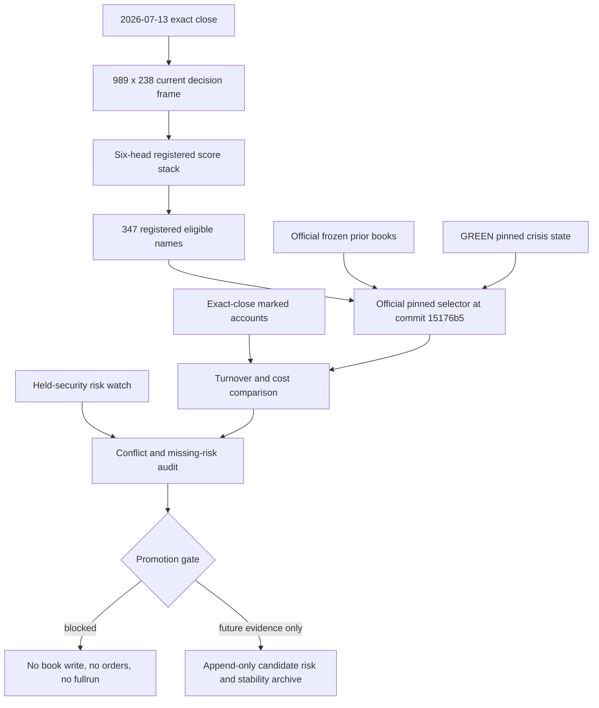

# Run287 current selector no-write result - 2026-07-14

## Decision

The official pinned selector was run on the complete 2026-07-13 close score
stack, but neither portfolio is approved for transition. The packet is
`READY_CURRENT_SELECTOR_NO_WRITE_REVIEW_REQUIRED`; it is not a target book and
does not change historical CAGR/MDD, holdings, cash, orders, or production.

The current one-date proposals have material turnover. Main also contains
incremental-buy conflicts with the existing held-security risk watch, while
every scenario contains proposed new entries that have not yet received the
same position-level risk evaluation. Concentrated avoids held-risk buy
conflicts but raises advisory cash to 34.09% and still requires 60.80% one-way
turnover.

## Frozen historical controls

| Portfolio | CAGR | MDD | Target gap |
|---|---:|---:|---:|
| Main | 34.4032% | -25.3619% | +0.5968%p CAGR and +0.3619%p MDD recovery |
| Concentrated | 49.0971% | -22.9552% | +0.9029%p CAGR; MDD already passes |

These metrics still end at the completed 2026-07-10 historical replay. The
current selector is a one-date advisory audit and is not historical return
evidence.

## Current gate inputs

- Valuation close: `2026-07-13`, the latest completed US trading close at the
  decision time.
- Candidate universe: 989 names; registered new-entry set: 347 names.
- Frozen `DD` corporate-action quarantine: retained.
- Pinned policy commit: `15176b588d5bb0792bce1df6367758d795a8a33a`.
- Current crisis state: `GREEN`; price and long-crisis states are both GREEN.
- Relative-strength prices: all 989 equities plus exact-close SPY, QQQ, SMH,
  and SOXX. SOXX was recovered in one bounded source request before the
  selector; the selector itself made zero network requests.
- Selector prior semantics: latest official frozen target books.
- Turnover baseline: exact-close 2026-07-13 marked account weights, including
  current cash.

Six official prior holdings are not in the current registered entry set:
`ALAB`, `CIEN`, `HPE`, `ON`, `QCOM`, and `RVMD`. The Main strict scenario exits
them if the policy does not otherwise retain them. The bridge scenario may
evaluate them only as existing holdings; it never admits them as new entries.

## Portfolio results

| Scenario | Advisory holdings | Cash | One-way turnover vs marked | 25bp cost | Held-risk buy conflicts | New buys without risk watch |
|---|---|---:|---:|---:|---:|---:|
| Main strict | FLEX, FTNT, PANW, COHU, AMAT, AMD, ARM, DELL, MRVL, MU, SNDK, STX, UMC, WDC | 8.5985% | 50.1923% | $1,885.10 | 2, including 1 freeze | 7 |
| Main prior-hold bridge | FLEX, ALAB, FTNT, PANW, AMD, ARM, DELL, MRVL, MU, SNDK, STX, UMC, WDC, HPE | 7.5889% | 44.7147% | $1,654.31 | 4, including 2 freeze | 5 |
| Concentrated strict | AMD, UMC, DELL, MU, ARM | 34.0937% | 60.8017% | $4,202.53 | 0 | 2 |

The cost estimates apply 25 basis points to absolute asset transactions and do
not charge the cash row. Sensitivity outputs also include 50 and 100 basis
points. At 100 basis points the estimated drag is 0.9773% of Main equity under
strict, 0.8576% under the bridge, and 1.0498% of Concentrated equity.

### Why Concentrated cash is high

The base GREEN crisis cash target is only 3%. The 34.09% result is primarily a
capacity and per-name risk-cap outcome, not a new discretionary macro call:

1. The selected/capped book leaves 30.625% unallocated before the regime
   overlay. MU and ARM are limited to 4% before the overlay, DELL to 12%, and
   the other selected names cannot absorb all residual weight under the pinned
   caps.
2. The pinned neutral-regime capacity multiplier then scales gross exposure by
   0.95, increasing cash from 30.625% to 34.0937%.
3. The candidate funnel rejects 177 rows because Concentrated requires a dual
   leader and rejects 29 more because price trend is not alive.

This is defensible as a risk-controlled advisory output, but it is not yet
evidence that 34% cash is return-optimal. The existing marked Concentrated
cash is 17.4686%.

## Why CAGR/MDD has not visibly improved

The recent work repaired measurement and current-decision integrity rather
than searching many more in-sample variants. It established exact-close data,
accepted-time joins, complete scoring, nonzero stack parity, and current risk
monitoring. Those controls prevent false improvements but do not themselves
alter the frozen replay.

The free SEC filing-quality lane was independently rejected and is frozen in
the do-not-repeat registry. The historical estimate/guidance lane remains
blocked until a real timestamped PIT sample supplies stable IDs, delisted
coverage, ADR/global coverage, and reproduction rights. Current free snapshots
remain forward-only. Therefore no legitimate new historical arm has crossed
the source-screen, fixed-book, and generated-book gates.

The current score stack also changes the cross-section materially relative to
the earlier incomplete substrate. That produces high one-date turnover. Using
it immediately would replace a data-quality problem with a transition-cost and
signal-stability problem.

## Next sequence

1. The no-order candidate-risk packet is complete for `AMAT`, `ARM`, `COHU`,
   `DELL`, `FTNT`, `PANW`, and `STX`: STX is ALERT; AMAT and COHU are WATCH;
   the other four are NORMAL but not buy-authorized.
2. Append the unchanged selector and risk output after each completed eligible
   close. Start an
   early stability review after four distinct decision weeks, but do not
   promote before at least 12 decision-week blocks and resolved forward
   outcomes satisfy the existing forward evidence contract.
3. Keep only the preregistered strict and Main prior-hold bridge scenarios. Do
   not create a turnover-threshold or cash-target grid after seeing this
   result.
4. Continue the free forward archive independently. It stays paper-only and
   cannot change seven-year CAGR/MDD.
5. Keep historical CAGR/MDD research blocked until a genuine PIT
   estimate/guidance sample passes schema, chronology, coverage, rights, and
   single-source return gates. No paid acquisition is authorized by this
   packet.

## Safety and evidence

- Target-book files written: `0`.
- Orders generated: `false`.
- Backtest/fullrun executed: `false`.
- Production/live trading: disabled.
- Selector projection rerun parity: exact within `1e-12`.
- Local PR validation: `165/165` passed in `427.1` seconds.
- Output packet:
  `outputs/run287_current_selector_no_write_20260714_close_20260713_v2/`.
- Candidate-risk packet:
  `outputs/run287_candidate_risk_watch_20260714_close_20260713/`.
- The earlier non-risk-intersection packet remains preserved as append-only
  evidence under the same name without `_v2`.
