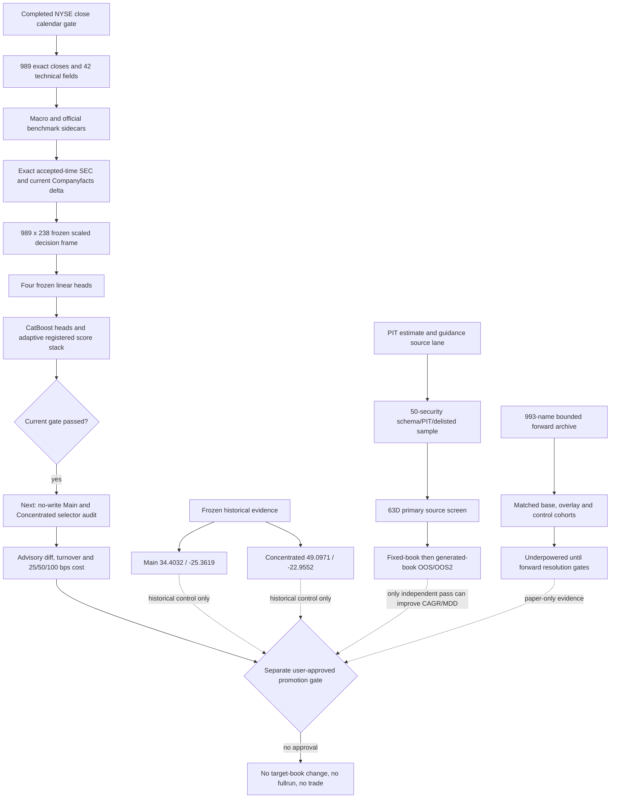

# Run287 system flow and current score-stack gate - 2026-07-14

## Outcome

The complete system flow was reconciled before opening the next selector step.
The immediate current-decision bottleneck is now cleared: the frozen registered
score stack was reproduced on the complete 2026-07-13 close frame with all six
active non-ranker heads present and unchanged through the stack join.

This result is non-ranking research evidence. It does not change either target
book, historical CAGR/MDD, cash, holdings, orders, or the forward ledger.

## Current validated positions in the flow

| Lane | Current state | What it can prove | Next gate |
|---|---|---|---|
| Historical endpoint | Main 34.4032% / -25.3619%; Concentrated 49.0971% / -22.9552% | Frozen CAGR/MDD control through the 2026-07-10 close | No change without a fully gated candidate |
| Daily decision data | 989 tickers, 238 features, 100% finite scaled matrix, zero future rows | Current-decision input completeness under missing-neutral scaling | Passed |
| Linear scoring | 3,956/3,956 finite cells, independent parity 4/4 | Frozen linear-head arithmetic | Passed |
| Registered score stack | Six active heads, passthrough 6/6, CatBoost parity 2/2, determinism 13/13 | Current score and eligibility construction without ranking | Passed in this change |
| Current selector | Not run | Main/Concentrated candidate and turnover differences | Next, separate no-write audit |
| Historical new alpha | Free SEC filing-quality source rejected | Nothing promotable from the closed SEC lane | Await PIT estimate/guidance sample |
| Forward archive | 90 observations, two decision dates, 11 distinct true-forward tickers, zero resolved 63D | Early operational evidence only | Continue bounded collection; still `UNDERPOWERED` |
| Production/fullrun | Disabled | Nothing | Separate explicit approval remains mandatory |

The historical endpoint contract remains integer shares, next close, 25 bps per
side, and one-business-day-lagged DGS3MO cash carry. Main still misses both the
35% CAGR and -25% MDD gates. Concentrated passes MDD but still misses 50% CAGR.

## Score-stack audit result

- Status: `READY_CURRENT_DECISION_SCORE_STACK_ELIGIBILITY_AUDIT_NONRANKING`
- Valuation close: `2026-07-13`
- Decision time: `2026-07-14T05:00:00Z`
- Tickers: `989`
- Frozen model features: `238`
- Active non-ranker prediction heads: `6 / 6`
- Fresh prediction passthrough: `6 / 6`
- CatBoost batch/chunk parity: `2 / 2`
- Registered stack deterministic parity: `13 / 13`
- Registered eligible tickers: `347`
- Research eligible after frozen `DD` quarantine: `347`
- Network requests and source/target mutations: `0`
- Local PR validation: `161 / 161` passed in `340.7` seconds

Canonical evidence:

- `outputs/run287_current_decision_score_stack_20260714_close_20260713/manifest.json`
- `outputs/run287_current_decision_score_stack_20260714_close_20260713/ticker_order_score_stack.csv`
- Decision-frame manifest SHA-256:
  `96e58406e9a82c9a3847f94dedfd9ff3c1a46127e7a77aa432c38823d40fda72`
- Score-only manifest SHA-256:
  `4cdbe8b64bfad53496fc4fbe759a98cb1ad0a519473001ae68f7e0fcdc63212e`
- Frozen engine-anchor manifest SHA-256:
  `2322a668a2b500f217b780ad28763e93ac5f6773a6f98b56438123caf561f2da`
- Current ticker-order score stack SHA-256:
  `5e199c4a26e343222fcdc55eb2c332b4aee89b6dfd33344f8c1d99f10f08cf58`

## Repaired failure mode

The older 2026-07-10 score-stack packet reported deterministic engine parity,
but its emitted linear and CatBoost prediction columns were all zero. Its
selection context already contained stale `pred_*` fields. A direct merge made
Pandas create suffixed fields, after which registered scoring could not find
the expected names and defaulted them to zero.

The old packet is therefore used only as a hash-pinned engine-artifact anchor
for CatBoost models, the adaptive bundle, scored OOS history, and the frozen
corporate-action audit. It is not used as a score-value control.

The repaired contract removes every embedded prediction field before joining
the freshly verified heads. It then fails closed unless each of the six active
heads is finite, nonzero, nonconstant, and exactly preserved through the stack.
Low-cost smoke tests cover the stale-column collision and silent all-zero-head
failure without importing or running CatBoost.

The complete local PR validation suite passed `161/161` in 340.7 seconds,
including the portfolio, cash, cost, PIT, direct-fullrun guard, daily operation,
and public dashboard contracts.

## Bottlenecks and next sequence

1. Run one separate no-write selector audit from this immutable score-stack
   output. Sorting may be inspected inside that audit, but it must not write
   target books or orders.
2. Compare Main and Concentrated advisory candidates with the current frozen
   targets. Report additions, removals, rank gaps, gross/cash implications,
   turnover, and 25/50/100 bps implementation costs.
3. Do not merge or reuse PR #280 as the selector input. It was based on a
   partial 2026-07-13 ranking whose rows explicitly had incomplete decision
   features and is retained only as stale diagnostic reference.
4. Continue the forward archive independently. Do not promote it to seven-year
   CAGR/MDD evidence before its preregistered ticker, outcome, and week-block
   gates resolve.
5. Historical CAGR/MDD improvement remains blocked on a real timestamped PIT
   estimate/guidance sample with delisted and ADR/global coverage. Only a
   source-screen pass may proceed to fixed-book and generated-book A/B.

No direct growth tilt, SEC veto/replacement, broad gross floor, stop/exit-delay,
proxy grid, or hindsight ticker/era exclusion is reopened by this result.
